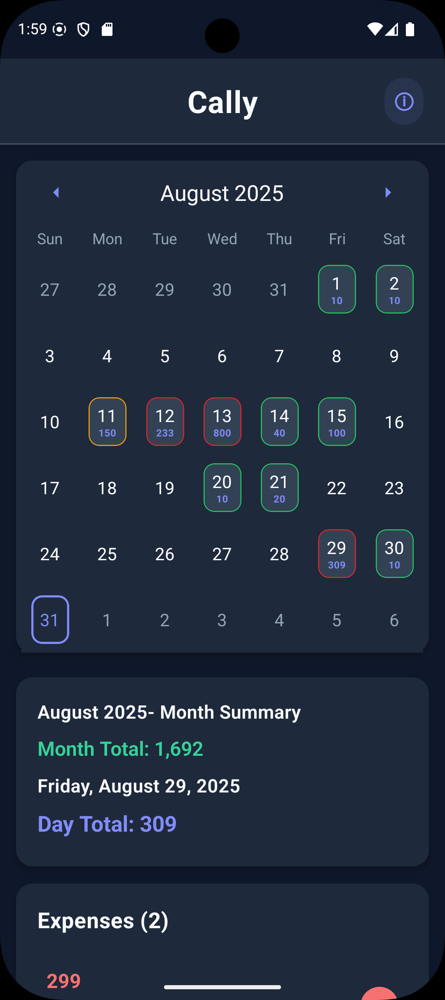
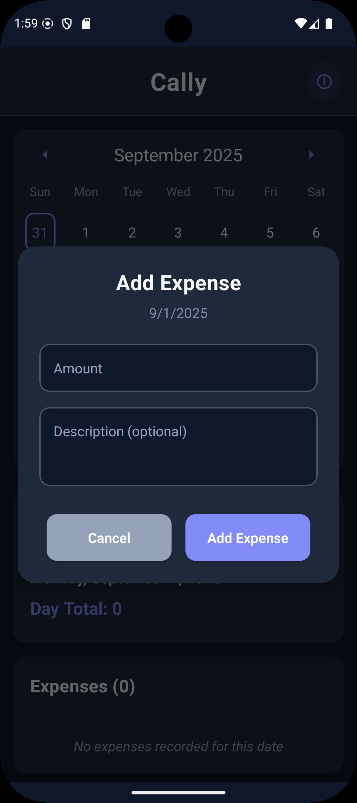
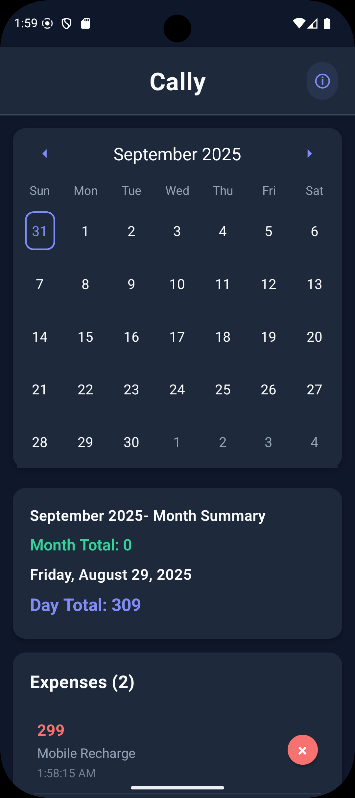
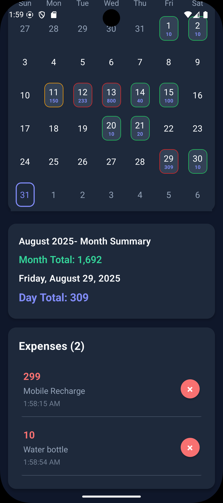

# 📱 Cally - Smart Expense Tracking App

## 🎯 **What is Cally?**

Cally is a **powerful yet simple expense tracking app** built with React Native that transforms your phone into a smart financial companion. Track your daily spending with beautiful calendar integration, get instant summaries, and never lose track of your expenses again.

### 💡 **Why Choose Cally?**

- **📅 Visual Calendar Tracking**: See your expenses directly on calendar dates - no more guessing what you spent when
- **🎨 Smart Color Coding**: Calendar days change colors based on spending levels (Green ≤ 100, Yellow ≤ 200, Red > 200)
- **📊 Instant Summaries**: Get daily and monthly totals automatically calculated
- **🌙 Beautiful Dark Theme**: Easy on the eyes with a professional dark interface
- **💾 Offline Storage**: Your data stays on your device - completely private and secure
- **⚡ Lightning Fast**: Add expenses in seconds with just amount and optional description
- **🗑️ Easy Management**: Delete unwanted entries with a single tap

### 🚀 **What You Can Do:**

✅ **Track Daily Expenses**: Add any amount with optional descriptions  
✅ **Visual Calendar View**: See spending patterns at a glance  
✅ **Monthly Summaries**: Know exactly how much you spent each month  
✅ **Quick Entry**: Add expenses in under 10 seconds  
✅ **Smart Organization**: Browse through months of expense history  
✅ **Secure Storage**: All data stored locally on your device  
✅ **Professional Design**: Clean, modern interface that's pleasant to use

## 📱 Download Now

<div align="center">
  <a href="https://api.dipkumarpal.me/public/download/cally.apk" download>
    
  </a>
</div>

> **📲 Quick Install**: Download the APK file above and install directly on your Android device

 <!-- Add your demo GIF here -->

## 📖 User Manual

### 🏠 Main Interface

 <!-- Add your main interface screenshot -->

The app opens to a clean calendar view showing the current month with your expense data.

### 📅 Using the Calendar

1. **View Expenses**: Days with expenses show the total amount below the date
2. **Color Coding**:
   - 🟢 Green: Low expenses (under 100)
   - 🟡 Yellow: Medium expenses (100-200)
   - 🔴 Red: High expenses (over 200)
3. **Navigate Months**: Use arrow buttons to browse different months
4. **Select Dates**: Tap any date to add or view expenses

 <!-- Add calendar features screenshot -->

### 💰 Adding Expenses

 <!-- Add modal screenshot -->

1. **Tap a Date**: Select any date on the calendar
2. **Enter Amount**: Input the expense amount (required)
3. **Add Description**: Optional description for your expense
4. **Save**: Tap "Add Expense" to save

**Example:**

- Amount: `25.50`
- Description: `Coffee and breakfast`

### 📊 Viewing Summaries

 <!-- Add summary screenshot -->

The app automatically calculates:

- **Monthly Total**: Total expenses for the current month
- **Daily Total**: Total expenses for the selected date
- **Expense Count**: Number of expenses for the selected date

### 🗑️ Managing Expenses

 <!-- Add management screenshot -->

- **View Details**: See amount, description, and timestamp
- **Delete Expenses**: Tap the "×" button to remove any expense
- **Browse History**: Navigate through months to view past expenses

### ℹ️ Developer Information

 <!-- Add developer info screenshot -->

Tap the "ⓘ" button in the header to view developer contact information and connect on LinkedIn.

## 🌟 Features

- **📅 Calendar Integration**: Visual expense tracking directly on calendar dates
- **💰 Smart Summaries**: Daily and monthly expense totals at a glance
- **🌙 Dark Theme**: Beautiful dark mode interface for comfortable viewing
- **💾 Local Storage**: Secure offline data storage with AsyncStorage
- **📊 Color-Coded Days**: Calendar days change color based on expense amounts
- **📝 Detailed Entries**: Add descriptions and timestamps to your expenses
- **🗑️ Easy Management**: Quick delete functionality for expense entries

## 📸 Screenshots

| Calendar View                                | Add Expense                                   | Expense List                                    | Monthly Summary                                       |
| -------------------------------------------- | --------------------------------------------- | ----------------------------------------------- | ----------------------------------------------------- |
|  |  |  |  |

<!-- Add your screenshot images to the screenshots folder -->

## 🚀 Getting Started

### Prerequisites

- [React Native Development Environment](https://reactnative.dev/docs/set-up-your-environment)
- [Node.js](https://nodejs.org/) (v16 or higher)
- [Android Studio](https://developer.android.com/studio) (for Android)
- [Xcode](https://developer.apple.com/xcode/) (for iOS, macOS only)

### Installation

1. **Clone the repository**

   ```bash
   git clone https://github.com/yourusername/cally.git
   cd cally
   ```

2. **Install dependencies**

   ```bash
   npm install
   # or
   yarn install
   ```

3. **iOS Setup** (iOS only)

   ```bash
   cd ios && pod install && cd ..
   ```

4. **Start Metro Server**

   ```bash
   npm start
   # or
   yarn start
   ```

5. **Run the app**

   ```bash
   # Android
   npm run android
   # or
   yarn android

   # iOS
   npm run ios
   # or
   yarn ios
   ```

## 🏗️ Component Architecture

### 📁 Project Structure

```
src/
├── components/           # React components
│   ├── AppContent.jsx           # Main app container
│   ├── Header.jsx               # App header with title & info
│   ├── CalendarComponent.jsx    # Calendar wrapper component
│   ├── CustomDay.jsx            # Custom calendar day display
│   ├── SummaryComponent.jsx     # Monthly/daily summaries
│   ├── ExpensesList.jsx         # Expense list with delete
│   ├── AddExpenseModal.jsx      # Add expense modal form
│   ├── DeveloperInfoModal.jsx   # Developer info modal
│   └── index.js                 # Component exports
├── services/             # Business logic services
│   ├── ExpenseStorage.js        # AsyncStorage service
│   └── index.js                 # Service exports
├── theme/               # Design system
│   ├── colors.js               # Color definitions
│   └── index.js                # Theme exports
└── utils/               # Utility functions
    ├── helpers.js              # Helper functions
    └── index.js                # Utility exports
```

### 🧩 Component Details

#### **Core Components**

##### `App.jsx` (Entry Point)

- Sets up SafeAreaProvider and StatusBar
- Renders AppContent component
- Handles app-level configuration

##### `AppContent.jsx` (Main Container)

- **State Management**: All app state and business logic
- **Data Flow**: Coordinates between child components
- **Event Handling**: Manages user interactions
- **Storage Integration**: Connects to ExpenseStorage service

##### `Header.jsx` (App Header)

- **App Title**: Displays "Cally" branding
- **Info Button**: Opens developer information modal
- **Consistent Styling**: Maintains design system

##### `CalendarComponent.jsx` (Calendar Wrapper)

- **Calendar Display**: Integrates react-native-calendars
- **Custom Day Rendering**: Uses CustomDay component
- **Date Selection**: Handles date press events
- **Month Navigation**: Manages month changes

##### `CustomDay.jsx` (Calendar Day)

- **Expense Display**: Shows daily expense totals
- **Color Coding**: Visual indication of expense levels
- **State Handling**: Selected, today, disabled states
- **Touch Interaction**: Handles day selection

#### **Feature Components**

##### `SummaryComponent.jsx` (Summaries)

- **Monthly Total**: Calculates and displays month expenses
- **Daily Total**: Shows selected date expenses
- **Date Formatting**: Human-readable date displays
- **Currency Formatting**: Consistent money display

##### `ExpensesList.jsx` (Expense Management)

- **Expense Display**: Lists all expenses for selected date
- **Delete Functionality**: Remove expenses with confirmation
- **Empty State**: Handles no expenses scenario
- **Detailed View**: Shows amount, description, timestamp

##### `AddExpenseModal.jsx` (Add Expense)

- **Form Handling**: Amount and description inputs
- **Validation**: Ensures valid expense data
- **Keyboard Support**: Optimized for mobile input
- **Modal Management**: Open/close animations

##### `DeveloperInfoModal.jsx` (Developer Info)

- **Contact Information**: Developer details
- **LinkedIn Integration**: Direct link to profile
- **Professional Presentation**: Clean, branded display

#### **Services & Utilities**

##### `ExpenseStorage.js` (Data Service)

- **CRUD Operations**: Create, Read, Update, Delete expenses
- **AsyncStorage Wrapper**: Handles data persistence
- **Error Handling**: Graceful error management
- **Data Validation**: Ensures data integrity

##### `helpers.js` (Utilities)

- **Currency Formatting**: Consistent money display
- **Date Utilities**: Month key generation
- **Calculations**: Monthly total computations

##### `colors.js` (Design System)

- **Color Definitions**: Centralized color scheme
- **Dark Theme**: Professional dark mode colors
- **Consistency**: Ensures uniform appearance

### 🔄 Data Flow Architecture

```
User Input
    ↓
AppContent (State Management)
    ↓
ExpenseStorage (Data Persistence)
    ↓
AsyncStorage (Device Storage)
    ↓
UI Update (Components Re-render)
```

### 🎯 Benefits of This Architecture

1. **🔧 Maintainability**: Easy to find and fix issues
2. **🚀 Scalability**: Simple to add new features
3. **🧪 Testability**: Each component can be unit tested
4. **♻️ Reusability**: Components can be reused across the app
5. **📖 Readability**: Clear separation of concerns
6. **🎨 Consistency**: Centralized styling and theme

### 📈 Performance Optimizations

- **React.memo**: Prevents unnecessary re-renders
- **useCallback**: Optimizes event handlers
- **Lazy Loading**: Components load only when needed
- **Efficient Storage**: Minimal AsyncStorage operations

## 🛠️ Development Commands

```bash
# Development
npm start                 # Start Metro server
npm run android          # Run on Android
npm run ios             # Run on iOS
npm run lint            # Check code quality
npm run format          # Format code

# Production
npm run build           # Build for production
npm run release         # Create release build

# Maintenance
npm run clean           # Clean build cache
npm run reset-cache     # Reset Metro cache
```

## 🧪 Testing

```bash
npm test                # Run all tests
npm run test:watch      # Watch mode for development
npm run test:coverage   # Generate coverage report
npm run test:e2e        # End-to-end testing
```

## 📱 Platform Support

- ✅ **Android**: API level 21+ (Android 5.0+)
- ✅ **iOS**: iOS 12.4+
- 🎯 **Optimized for**: Modern smartphones and tablets
- 📱 **Responsive**: Adapts to different screen sizes

## 🔧 Configuration

The app uses several configuration files:

- `app.json` - React Native app configuration
- `metro.config.js` - Metro bundler configuration
- `babel.config.js` - Babel transformer configuration
- `tsconfig.json` - TypeScript configuration

## 📊 Analytics & Tracking

The app focuses on privacy and doesn't include:

- ❌ User tracking
- ❌ Data collection
- ❌ Third-party analytics
- ✅ Local-only storage

## 🤝 Contributing

1. **Fork** the repository
2. **Create** your feature branch (`git checkout -b feature/AmazingFeature`)
3. **Commit** your changes (`git commit -m 'Add some AmazingFeature'`)
4. **Push** to the branch (`git push origin feature/AmazingFeature`)
5. **Open** a Pull Request

### 🔍 Code Standards

- Follow React Native best practices
- Use meaningful component and variable names
- Write clean, self-documenting code
- Include comments for complex logic
- Test your changes thoroughly

## 📋 Roadmap

### 🎯 Planned Features

- [ ] **Categories**: Organize expenses by category
- [ ] **Export Data**: CSV/PDF export functionality
- [ ] **Charts**: Visual expense analytics
- [ ] **Cloud Sync**: Optional cloud synchronization
- [ ] **Multi-Currency**: Support for different currencies
- [ ] **Recurring**: Set up recurring expenses
- [ ] **Budgets**: Budget tracking and alerts
- [ ] **Search**: Find specific expenses quickly

### 🚀 Technical Improvements

- [ ] **Unit Tests**: Comprehensive test coverage
- [ ] **E2E Tests**: End-to-end testing with Detox
- [ ] **Performance**: Further optimization
- [ ] **Accessibility**: Enhanced accessibility support

## 🐛 Known Issues

Currently no known issues. If you encounter any problems, please [open an issue](https://github.com/yourusername/cally/issues).

## 📄 License

This project is licensed under the MIT License - see the [LICENSE](LICENSE) file for details.

## 👨‍💻 Developer

**Dip Kumar Pal**

- 🔗 LinkedIn: [linkedin.com/in/dip-kumar-pal-9a571a260](https://www.linkedin.com/in/dip-kumar-pal-9a571a260/)
- 🐙 GitHub: [DipPal07](https://github.com/DipPal07)
- 📧 Email: [dipkup4@gmail.com](mailto:dipkup4@gmail.com)

## 🙏 Acknowledgments

- React Native team for the amazing framework
- Calendar library contributors
- Design inspiration from modern expense tracking apps
- Open source community for continuous support

---

## 📱 Download & Try

⭐ **Star this repository if you found it helpful!**

📥 **Clone and try the app:**

```bash
git clone https://github.com/DipPal07/cally.git
cd cally
npm install
npm run android  # or npm run ios
```

---

_Built with ❤️ using React Native_
